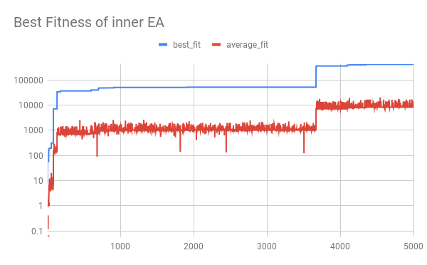
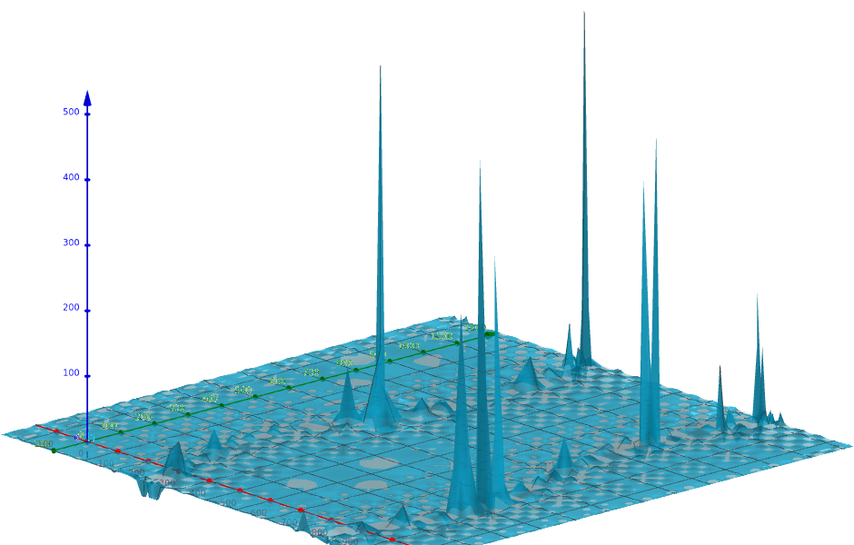
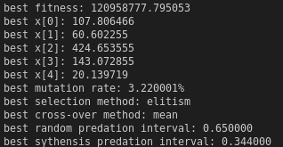

# double-evolutionary-algorithm
Algoritmo evolutivo que ajusta outro algoritmo evolutivo.


## resultado
### resultado obtido com função de fitness com ℝ<sup>5</sup>



### função fitness iluminado somente com 2D



### exemplo de uma saída


## como usar
```sh
make
./main 1000 # número de gerações de AG2
```
no `main.c` existem constantes que podem ser mudadas.
```c
#define maxx 1000 // inner genes range [0, 1000]
#define pop 10 // inner EA population
#define pop2 5 // outer EA population
#define inner_loop 500 // inner EA max generation
#define heritage_max 10 // hereditary store array
#define mutation_rate_squared 50 // per 1000  == 5% of range
#define predation_mutation_rate 50 // per 1000 == 5% of range
```
## conceitos usados

### 1. Mutação variada
Taxa de mutação é a quantidade a ser modificada em um gene escolhido para mutar. Essa taxa é porcentagem do eixo e não o valor atual do gene.
Todos os cromossomos tem que sofrer modificações (mutação e/ou cross-over) e tentar não avaliar um certo cromossomo mais de uma vez.
Com a mutação variada podemos tentar sair do máximo local.
Aumentar a taxa de mutação quando o melhor fitness não está evoluindo. (travado em máximo local)
Diminuir taxa de mutação antes de aumentar por umas gerações como ajuste fino.

### 2. sorteio de número de genes
Ao mutar um cromossomo com N genes, é possível mutar
1 a N genes em uma mutação. A recomendação é em 50% das mutações, só mutar só um gene. No caso contrário pode ficar impossível alcançar uma combinação boa.

### 3. Crossover com delta
Um jeito sofisticado de fazer cross-over é usar delta, a diferença entre os cromossomos parentes. com esse valor temos várias opções de mutação. (pai + delta, pai - delta, mãe + delta, etc...)


### 4. Predação do pior indivíduo por um aleatório
Predação é o conceito que elimina o cromossomo com o menor desempenho uma vez por um certo período. No mínimo 0 vezes e no máximo a cada gerações. Predação clássica intensifica a diversidade além da mutação. Com a predação do pior indivíduo, é incluso um indivíduo aleatório na população.

### 5. Predação por síntese
Predação por síntese tem um comportamento parecido com o classico mas invés de aumentar a diversidade ele acelera a convergência. Ao eliminar o pior indivíduo, o novo indivíduo é sintetizado com os genes mais populares da população atual, diminuindo a diversidade.

### 6. genocídio ao chegar num dead-end
Genocídio é um conceito usado para poder reiniciar a evolução a partir de zero, quando o melhor da população está travado num ponto por um tempo prolongado.

### 7. AG2 com parâmetros de AG1
O conceito de AG duplo é usar os parâmetros do AG como taxa de mutação, período de predação e métodos de seleção e crossover como genes de um outro AG e rodar outro AG. A função fitness do AG2 é o fitness obtido com o AG1 com os seus genes como parâmetros.
### 8. Ruidos e Hereditariedade
Para simular a realidade mais robustamente precisa se entender os ruidos. As variáveis não codificadas que afetam no fitness são considerados ruidos. Nesse caso um cromossomo não se produz somente um valor exato de fitness. Para ajustar o algoritmo em casos de sortes e desastres, o conceito de hereditariedade guarda os resultados históricos e somente determina o melhor cromossomo com a todo conjunto de valores históricos.

## desafio (to-do)

* usar um problema real para ajustar os parâmetros.
* uma função fitness para AG2 que coloca em conta o tempo de processamento, velocidade e eficiência.
